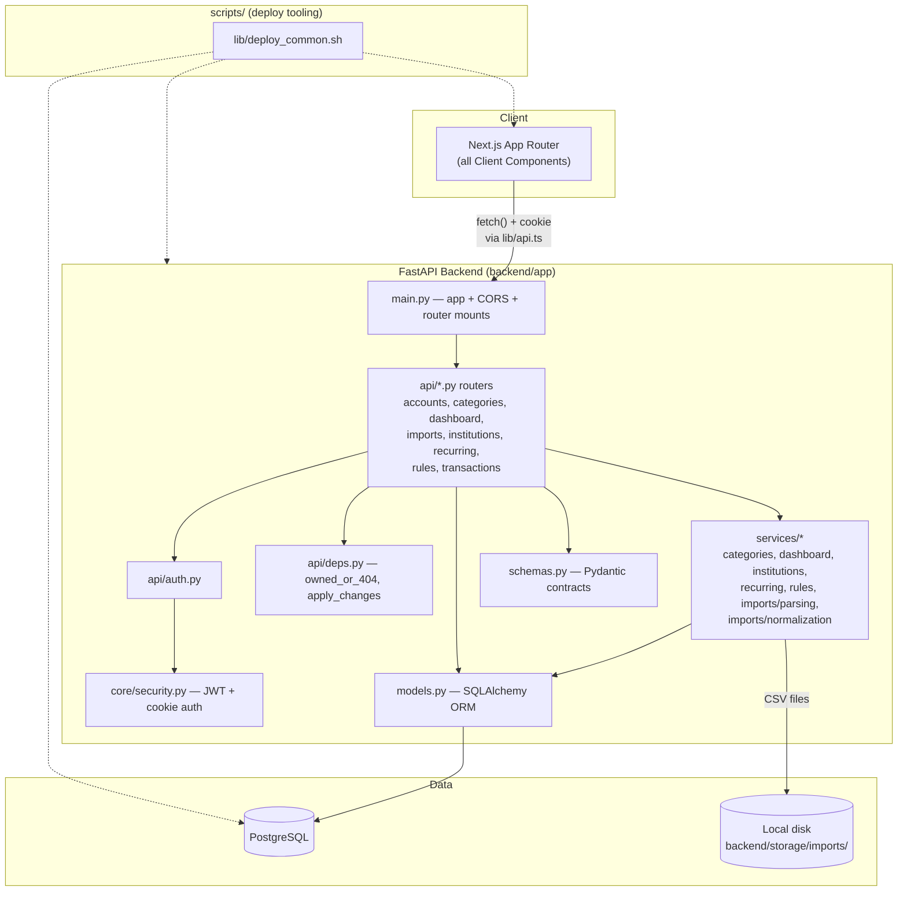
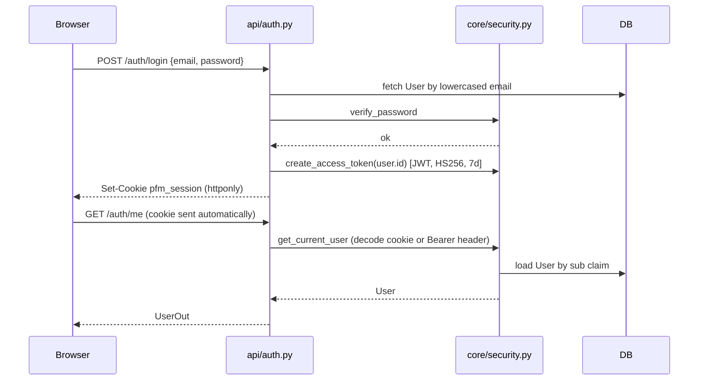
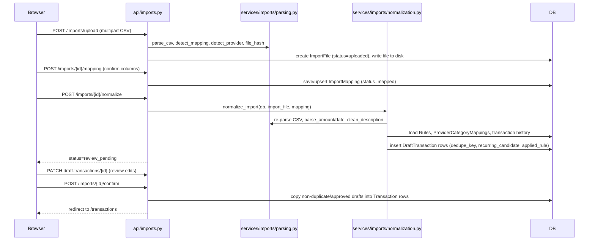
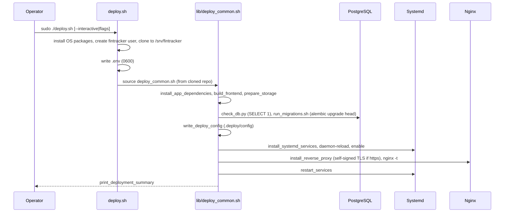

# Codebase Map

> Auto-generated by Cartographer. Last mapped: 2026-07-13T01:19:31Z

## System Overview

**Ledgerly** — a local-first personal finance tracker. FastAPI + SQLAlchemy 2.0 + Postgres backend; Next.js 15 (App Router, all Client Components) frontend. Users import bank CSV statements, review/normalize transactions into a ledger, categorize via rules, and view dashboards. No third-party bank integration (Plaid), no OCR, no budgets, no cloud sync — CSV import is the sole data-entry path besides manual edits.



## Directory Structure

```
.
├── README.md                    Product overview, setup, deploy docs
├── .env.example                 Canonical env var template
├── backend/
│   ├── app/
│   │   ├── main.py               FastAPI app factory, router mounts, CORS, /health
│   │   ├── core/
│   │   │   ├── config.py         Settings (pydantic-settings), .env loading
│   │   │   ├── database.py       SQLAlchemy engine/session, Base, get_db()
│   │   │   └── security.py       Password hashing, JWT, get_current_user
│   │   ├── api/                  FastAPI routers, one per resource
│   │   │   ├── deps.py           owned_or_404, apply_changes (shared helpers)
│   │   │   ├── auth.py           register/login/logout/me
│   │   │   ├── accounts.py       Accounts + AccountInstruments CRUD
│   │   │   ├── categories.py     Categories/Subcategories/provider mappings
│   │   │   ├── dashboard.py      Read-only aggregate/report endpoints
│   │   │   ├── imports.py        CSV import pipeline endpoints
│   │   │   ├── institutions.py   Institution CRUD w/ name dedup
│   │   │   ├── recurring.py      Recurring series suggest/approve/reject
│   │   │   ├── rules.py          Auto-categorization rule CRUD + dry-run test
│   │   │   └── transactions.py   Ledger listing/search/export/edit
│   │   ├── models.py             All SQLAlchemy ORM models + enums
│   │   ├── schemas.py            All Pydantic request/response schemas
│   │   └── services/
│   │       ├── categories.py     seed_categories (starter taxonomy)
│   │       ├── dashboard.py      summary_payload aggregation helper
│   │       ├── institutions.py   name normalization + seed_institutions
│   │       ├── recurring.py      cadence detection, suggest_recurring
│   │       ├── rules.py          rule_matches, apply_first_matching_rule
│   │       └── imports/
│   │           ├── parsing.py        CSV parsing, header/provider detection
│   │           └── normalization.py  Draft-row generation, dedupe, rules
│   ├── migrations/               Alembic migrations (env.py + versions/)
│   ├── tests/                    Pytest unit tests (service-layer, DB-optional)
│   ├── alembic.ini, pyproject.toml, requirements.txt
│   └── storage/imports/          Uploaded CSV files (gitignored, kept via .gitkeep)
├── frontend/
│   ├── src/
│   │   ├── app/
│   │   │   ├── layout.tsx, page.tsx (redirects to /dashboard)
│   │   │   ├── login/, register/         Public auth pages
│   │   │   ├── (app)/                    Route group — AppShell-wrapped, auth-gated
│   │   │   │   ├── layout.tsx            Wraps children in <AppShell>
│   │   │   │   ├── dashboard/            Charts/summary (Recharts)
│   │   │   │   ├── accounts/             Accounts/institutions/instruments CRUD
│   │   │   │   ├── categories/           Category taxonomy + provider mappings
│   │   │   │   ├── imports/              Step 1: upload + history
│   │   │   │   │   └── [id]/mapping/     Step 2: column mapping
│   │   │   │   │   └── [id]/review/      Step 3: draft review + confirm
│   │   │   │   ├── recurring/            Recurring series management
│   │   │   │   ├── rules/                Auto-categorization rules
│   │   │   │   └── transactions/         Ledger, search, inline edit, export
│   │   │   └── globals.css               Hand-written CSS (no Tailwind)
│   │   ├── components/
│   │   │   ├── AppShell.tsx      Sidebar nav + auth guard (calls /auth/me)
│   │   │   └── Page.tsx          PageHeader/EmptyState/Badge primitives
│   │   └── lib/
│   │       ├── api.ts             fetch wrapper (cookie auth), money(), shortDate()
│   │       └── types.ts           Shared domain types mirroring backend schemas
│   ├── package.json, tsconfig.json, next.config.ts
└── scripts/                      Deployment & dev tooling
    ├── dev.sh                    Local dev launcher (backend + frontend concurrently)
    ├── deploy.sh                 Fresh Linux server bootstrapper (systemd + nginx)
    ├── update.sh                 In-place updater for existing deployments
    ├── run_migrations.sh         alembic upgrade head wrapper
    ├── check_db.py                DB connectivity pre-flight check
    ├── create_db.py               Idempotent DB creation helper
    ├── smoke_test.py              Manual end-to-end API smoke test
    └── lib/deploy_common.sh      Shared install/build/migrate/systemd/nginx pipeline
```

## Module Guide

### Backend Core (`backend/app/core/`)

**Purpose**: Cross-cutting infrastructure — settings, DB session management, auth primitives.

| File | Purpose | Tokens |
|------|---------|--------|
| `config.py` | `Settings` (pydantic-settings), `.env` loaded from repo root, computed `database_url`/`upload_path`/`allowed_origins` | 471 |
| `database.py` | `Base`, `engine`, `SessionLocal` (`expire_on_commit=False`, `autoflush=False`), `get_db()` dependency | 86 |
| `security.py` | `hash_password`/`verify_password` (pwdlib/Argon2), JWT issuance (PyJWT, HS256), `get_current_user` | 355 |

**Key facts**:
- `database_name`/`database_user`/`database_password` and `secret_key` (≥12 chars) have no defaults — app fails at startup without them.
- Postgres-only: `database_url` hardcodes `postgresql+psycopg://`; `dashboard.py` uses `func.date_trunc` (Postgres-specific).
- Auth supports both cookie (`pfm_session`, httponly) and `Authorization: Bearer` header in the same `get_current_user` dependency.
- Session `expire_on_commit=False` is why routes can `db.commit(); return item` without a refresh — the ORM object stays populated for response serialization.

### Backend API (`backend/app/api/`)

**Purpose**: Thin FastAPI routers — auth/db deps → query/mutate → commit → return, using `response_model` for most routes (imports/recurring return raw dicts instead).

| File | Purpose | Tokens |
|------|---------|--------|
| `deps.py` | `owned_or_404` (per-object ownership 404), `apply_changes` (partial PATCH via `exclude_unset`) | 111 |
| `auth.py` | register/login/logout/me, sets JWT session cookie, seeds categories+institutions on register | 485 |
| `accounts.py` | Accounts + nested AccountInstruments CRUD, soft delete via `is_active` | 958 |
| `categories.py` | Categories/Subcategories + ProviderCategoryMapping CRUD | 868 |
| `dashboard.py` | Read-only aggregates: summary, category-breakdown, monthly-trends, recurring, account/instrument summary | 1734 |
| `imports.py` | Upload → mapping → normalize → review → confirm/cancel pipeline; saved mappings | 3121 |
| `institutions.py` | Institution CRUD; POST is really an upsert-by-normalized-name | 684 |
| `recurring.py` | List/suggestions/approve/reject/edit/manual-add for recurring series | 719 |
| `rules.py` | Rule CRUD + `/test` dry-run against last 1000 transactions | 540 |
| `transactions.py` | Ledger list/search/export(CSV)/edit/bulk-edit | 1277 |

**Exports**: All routers are mounted in `main.py` in this order: `auth, institutions, accounts, imports, transactions, categories, rules, recurring, dashboard`.
**Dependencies**: `core.security`, `core.database`, `models`, `schemas`, `services/*`.
**Dependents**: Frontend pages via `lib/api.ts`.

### Backend Data & Services (`backend/app/models.py`, `schemas.py`, `services/`)

**Purpose**: The domain model, API contracts, and business logic (seeding, normalization, rule matching, recurring detection).

| File | Purpose | Tokens |
|------|---------|--------|
| `models.py` | SQLAlchemy 2.0 ORM (`Mapped`/`mapped_column`), all enums stored as non-native (`native_enum=False`) | 3880 |
| `schemas.py` | Pydantic v2 `XIn`/`XPatch`/`XOut` triads per resource | 2548 |
| `services/categories.py` | `STARTER_CATEGORIES`, `seed_categories` (not idempotent) | 448 |
| `services/dashboard.py` | `summary_payload` — pure aggregation-to-dict function | 127 |
| `services/institutions.py` | `clean_institution_name`/`normalize_institution_name`, `seed_institutions` (idempotent) | 337 |
| `services/recurring.py` | `cadence_for_days`, `next_date`, `suggest_recurring` | 689 |
| `services/rules.py` | `rule_matches`, `apply_first_matching_rule` | 574 |
| `services/imports/parsing.py` | CSV parsing, header alias/provider detection, amount/date parsing — no DB dependency | 1373 |
| `services/imports/normalization.py` | Orchestrates draft generation: amount normalization, type detection, dedupe, instrument matching, rule application, recurring-candidate flagging | 1807 |

**Exports**: `User, Institution, Account, AccountInstrument, ImportFile, ImportMapping, Category, Subcategory, ProviderCategoryMapping, Rule, DraftTransaction, Transaction, RecurringSeries` (models); matching schema classes.

**Data model summary** (see full table below): Every table has UUID PK + `created_at`/`updated_at` (via `IdMixin`/`TimestampMixin`) and a `user_id` FK with `ondelete=CASCADE` — multi-tenant by design, no roles/scopes beyond ownership.

### Frontend (`frontend/src/`)

**Purpose**: Next.js 15 App Router SPA-style client. Every page is a Client Component (`"use client"`) — no RSC data fetching, no `loading.tsx`/`error.tsx`. All data loading via `useEffect` + the `api()` helper.

| File | Purpose | Tokens |
|------|---------|--------|
| `lib/api.ts` | `api()` fetch wrapper (`credentials: "include"`), `ApiError`, `money()`, `shortDate()` | 324 |
| `lib/types.ts` | Shared domain types mirroring backend schemas | 495 |
| `components/AppShell.tsx` | Sidebar nav + the app's only auth guard (`GET /auth/me` on mount) | 484 |
| `components/Page.tsx` | `PageHeader`, `EmptyState`, `Badge` primitives | 220 |
| `app/(app)/dashboard/page.tsx` | Recharts-based summary/trends/breakdowns | 2348 |
| `app/(app)/accounts/page.tsx` | Accounts/institutions/instruments CRUD | 2407 |
| `app/(app)/categories/page.tsx` | Category taxonomy + provider mappings | 1366 |
| `app/(app)/imports/page.tsx` | Import step 1: upload + history + saved mappings | 1292 |
| `app/(app)/imports/[id]/mapping/page.tsx` | Import step 2: column mapping confirmation | 1523 |
| `app/(app)/imports/[id]/review/page.tsx` | Import step 3: draft review, inline edit, confirm | 1836 |
| `app/(app)/recurring/page.tsx` | Recurring series suggest/approve/reject | 1156 |
| `app/(app)/rules/page.tsx` | Rule CRUD | 1331 |
| `app/(app)/transactions/page.tsx` | Ledger search/filter/inline-edit/export | 1269 |
| `app/globals.css` | Hand-written CSS, no Tailwind/CSS Modules | 3849 |

**Dependencies**: All pages import `@/lib/api`, most import `@/lib/types` and `@/components/Page`.
**Dependents**: None (leaf layer, consumed by the browser).

### Deployment Scripts (`scripts/`)

**Purpose**: Bootstrap and maintain a production Linux deployment (systemd + nginx), plus local dev orchestration and manual verification tools.

| File | Purpose | Tokens |
|------|---------|--------|
| `dev.sh` | Local dev: preflight checks, `check_db.py`, `run_migrations.sh`, then uvicorn + `next dev` concurrently | 508 |
| `deploy.sh` | Fresh-server bootstrap: OS packages, `fintracker` user, clone, `.env`, then shared pipeline | 7765 |
| `lib/deploy_common.sh` | Shared install/build/migrate/systemd/nginx/restart functions used by `deploy.sh` and `update.sh` | 4022 |
| `update.sh` | In-place updater; requires prior `deploy.sh` run; git pull + self re-exec + shared pipeline | 1592 |
| `run_migrations.sh` | `alembic upgrade head` wrapper (does not source `.env` itself) | 53 |
| `check_db.py` | DB connectivity pre-flight (`SELECT 1`) | 133 |
| `create_db.py` | Idempotent `CREATE DATABASE` helper (run from repo root) | 178 |
| `smoke_test.py` | Manual end-to-end API test via `TestClient` against a real local DB; self-cleaning | 1000 |

**Exports**: None (standalone scripts).
**Dependencies**: `deploy_common.sh` sources nothing besides shell builtins/system tools; `check_db.py`/`create_db.py`/`smoke_test.py` import `app.core.config`/`app.main`/`app.models` directly.
**Dependents**: `README.md` documents all of these as the canonical setup/deploy path.

## Data Flow

### Auth flow



Per-request authorization beyond "is logged in" is enforced by `api/deps.py`'s `owned_or_404(db, Model, id, user.id)` — the sole ownership check; there are no roles/scopes.

### CSV import pipeline



### Deployment pipeline



`update.sh` re-runs the same shared pipeline (requires `.deploy/config` from a prior `deploy.sh` run, `DEPLOY_USER=fintracker`, `ROOT_DIR=/srv/fintracker`); it optionally `git pull --ff-only`s first, then re-execs itself with `--no-pull` so the pipeline runs against freshly-pulled code.

## Full Data Model

| Table | Key columns | Relationships |
|---|---|---|
| `users` | email (unique), password_hash, display_name | root tenant; nearly everything FKs here with `ondelete=CASCADE` |
| `institutions` | user_id, display_name, normalized_name (unique w/ user_id), is_system, is_active | referenced by accounts, import_files, import_mappings, provider_category_mappings |
| `accounts` | user_id, name, institution_id (SET NULL), account_type, last_four, currency | `instruments` (cascade delete-orphan) |
| `account_instruments` | user_id, account_id (CASCADE), instrument_type, cardholder_name, last_four, source_identifier (unique w/ account_id, nullable) | child of accounts; referenced by transactions/drafts |
| `import_files` | user_id, account_id (CASCADE), institution_id (SET NULL), storage_path, file_hash, status, row_count/duplicate_row_count | parent of draft_transactions (CASCADE); SET NULL on transactions |
| `import_mappings` | user_id, institution_id (required), mapping_name, header_signature (indexed), *_column fields, amount_behavior | reusable template matched via header_signature |
| `categories` | user_id, name (unique w/ user_id), is_system, sort_order | `subcategories` (cascade delete-orphan) |
| `subcategories` | user_id, category_id (CASCADE), name (unique w/ category_id) | child of categories |
| `provider_category_mappings` | user_id, institution_id, source_category (unique w/ user_id+institution_id), category_id, subcategory_id | bank category string → app category |
| `rules` | user_id, priority, match_field, match_operator, match_value, category_id/subcategory_id, mark_as_recurring | referenced by drafts via applied_rule_id |
| `draft_transactions` | (TransactionColumns mixin) + import_file_id (CASCADE), row_index, raw_row_json, recurring_candidate, duplicate_status, review_status | staging table for import review |
| `transactions` | (TransactionColumns mixin) + import_file_id (SET NULL), recurring_series_id; index (user_id, transaction_date) | confirmed ledger, source of truth for dashboards |
| `recurring_series` | user_id, merchant_name, expected_amount, amount_variability, cadence, status, next_expected_date | transactions link back via recurring_series_id |

`TransactionColumns` mixin (shared by `draft_transactions`/`transactions`, not its own table): user_id, account_id, account_instrument_id, transaction_date, posted_date, description_original/clean, merchant_name, amount, direction, transaction_type, category_id, subcategory_id, source_category, source_card_identifier, card_last_four, cardholder_name, is_excluded_from_spending, is_recurring, dedupe_key, provider_transaction_id, notes.

## Conventions

- **Backend**: `XIn`/`XPatch`/`XOut` schema triad per resource; `owned_or_404` + `apply_changes` shared helpers for nearly every router; soft deletes via `is_active` flags (never hard-delete); UUID PKs + `created_at`/`updated_at` on every table via mixins; enums stored as `native_enum=False` strings for painless additions.
- **Frontend**: every page is `"use client"`; data loading via `useEffect` + `api()` + local `useState`/`useMemo` (no SWR/React Query/Redux); optimistic-update-then-PATCH pattern for inline edits (accounts, review, transactions pages); modal-driven CRUD via a single `modal` state variable per page; money values are strings end-to-end (`Decimal` → JSON string → `money()` formatter).
- **Deployment**: every mutating step in `deploy_common.sh` is a discrete named function called in a fixed pipeline order by both `deploy.sh` and `update.sh`; secrets are always redacted in printed output; `set -euo pipefail` throughout.

## Gotchas

- **Duplicated business rules**: transfer/payment/adjustment auto-exclusion-from-spending logic is duplicated between `imports.py` and `transactions.py` (not centralized in a service).
- **Side-effecting GET**: `GET /recurring/suggestions` mutates state (creates/updates suggested `RecurringSeries` rows) despite being a read endpoint.
- **`0001_initial_schema.py`** uses `Base.metadata.create_all` rather than explicit DDL — it always reflects the *current* `models.py`, not a frozen snapshot; only `0002_normalize_institutions.py` is meaningfully exercised against pre-existing production databases.
- **`normalize_institution_name`** logic is intentionally copy-pasted (not imported) into migration `0002` since migrations can't safely depend on runtime app code — keep both in sync manually if normalization rules change.
- **`_match_instrument`** in `normalization.py` silently auto-creates inactive `AccountInstrument` rows for unseen card identifiers during normalize — a side effect outside the accounts API.
- **Frontend auth guard** is client-side only (`AppShell`'s `GET /auth/me` on mount) — no middleware/server check, so a flash of protected content is possible before redirect.
- **CSV export and file upload** bypass the `api()` wrapper (plain `<a href>` / native `<form>`) and rely on browser-native cookie handling instead of `fetch`.
- **`update.sh`** hardcodes `ROOT_DIR == "/srv/fintracker"` and `DEPLOY_USER == "fintracker"` — it cannot run against any other checkout location.
- **Route ordering matters** in `transactions.py`: `/export` must be defined before `/{transaction_id}` or FastAPI will treat "export" as a UUID path param.
- Both `deploy.sh` and `update.sh` do a hard `systemctl restart` (not reload) of both services on every run — brief downtime on every deploy/update.
- `scripts/create_db.py` uses a relative `sys.path` insert and must be run from the repo root; `scripts/run_migrations.sh` does not source `.env` itself and relies on the caller having exported DB env vars first.

## Navigation Guide

- **Add a new API endpoint**: add a route in the relevant `backend/app/api/*.py` file (or a new module, then mount it in `main.py`); add request/response schemas to `schemas.py`; add any new business logic to `services/`; use `owned_or_404`/`apply_changes` from `deps.py` for ownership-scoped CRUD.
- **Add a new frontend page**: create `frontend/src/app/(app)/<name>/page.tsx` (auto-picks up `AppShell` layout via the route group); add a nav entry in `components/AppShell.tsx`; add types to `lib/types.ts` if shared, or inline if page-local; use `api()` from `lib/api.ts` for all backend calls.
- **Modify auth**: `backend/app/core/security.py` (JWT/cookie logic), `backend/app/api/auth.py` (routes), `backend/app/api/deps.py` (ownership checks), frontend `components/AppShell.tsx` (client-side guard).
- **Modify the import pipeline**: `services/imports/parsing.py` (CSV parsing/detection) → `services/imports/normalization.py` (draft generation, dedupe, rules) → `api/imports.py` (routes/state machine) → frontend `app/(app)/imports/` three-step wizard.
- **Add a new DB table/column**: update `models.py`, then generate an Alembic migration (`alembic revision --autogenerate`) rather than relying on `0001`'s `create_all` for existing deployments.
- **Change deployment behavior**: shared logic lives in `scripts/lib/deploy_common.sh`; `deploy.sh` only handles first-time bootstrap (OS packages, user/clone creation); `update.sh` handles repeatable maintenance and assumes `deploy.sh` already ran.
